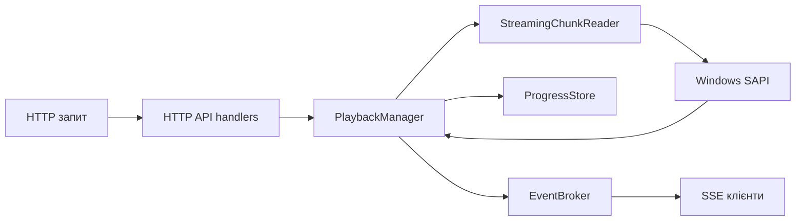

# Архітектура

## Коротко

`tts-reader` має два режими:

1. локальний CLI;
2. локальний HTTP API з SSE-подіями та браузерною панеллю.

Основний потік виконання побудований так:

## Потік даних

## Межі пакетів

Після механічного поділу великих файлів доменна логіка винесена з `package main` в `internal/core`.

`internal/core` містить:

- модель книги та in-memory `BookStore`;
- streaming chunk reader і UTF-8 byte-boundary helpers;
- `ProgressStore` і прив'язку progress до fingerprint книги;
- `TTSEngine` abstraction;
- `PlaybackManager`, session lifecycle і `EventBroker`.

Root package лишається application layer:

- CLI parsing і режим `read`;
- локальний HTTP API;
- dashboard;
- platform entrypoints для Windows SAPI.

Це дає реальну компіляторну межу: HTTP handlers і зовнішні тести більше не можуть звертатися до `PlaybackManager.mu`, `active`, `state`, `fail(...)` або lifecycle hooks. Низькорівневі adversarial-тести, які перевіряють stale sessions, durable position і race invariants, живуть поруч із доменним кодом у `internal/core`.

Наступний природний крок без зміни поведінки - розділити `internal/core` на менші пакети (`playback`, `book`, `progress`, `events`, `tts`). Поточний етап спеціально обмежений одним доменним пакетом, щоб не змішувати зміну lifecycle-логіки з широким переміщенням файлів.

### HTTP -> playback engine -> chunk reader -> Windows SAPI

- HTTP handlers приймають запити `POST /api/v1/playback`, `POST /api/v1/playback/pause`, `POST /api/v1/playback/resume`, `POST /api/v1/playback/stop` і `PUT /api/v1/playback/position`.
- Handlers викликають `PlaybackManager`.
- `PlaybackManager` керує станом відтворення, вибирає стартову позицію, запускає `StreamingChunkReader` і передає кожен chunk у TTS engine.
- `PlaybackManager` зберігає доменну помилку та `error_code`, а HTTP layer перетворює їх у публічний текст відповіді.
- На Windows TTS engine викликає PowerShell з `System.Speech`, а текст передається через `stdin`.

## Хто володіє goroutine

### HTTP server goroutine

- `runServe` запускає `server.ListenAndServe()` у окремій goroutine.
- Життєвий цикл цієї goroutine завершується через `server.Shutdown(...)`.

### Playback goroutine

- `PlaybackManager.Start` створює окрему goroutine для `play(...)`.
- Саме ця goroutine читає chunks, викликає TTS і зберігає progress.
- `Stop` скасовує session context, чекає завершення `session.done` і тільки потім завершує сесію.

### SSE goroutine

- SSE handler не створює фонову goroutine для delivery.
- Він лише підписується на `EventBroker` і блокується в request context.
- Коли клієнт закриває вкладку або сервер завершується, `r.Context()` спрацьовує, підписка закривається, канал клієнта відписується.

## Pause / Resume / Stop

### Pause

- `Pause` змінює стан на `paused`.
- Playback goroutine перевіряє стан через `waitUntilPlayable(...)` і чекає на `sync.Cond`.
- Відтворення не створює нову сесію, а лише тимчасово зупиняється.

### Resume

- `Resume` повертає стан у `playing`.
- `cond.Broadcast()` будить playback goroutine.
- Далі читання chunk продовжується з поточної позиції.

### Stop

- `Stop` скасовує session context.
- Далі `PlaybackManager` чекає завершення `session.done`.
- Після цього прогрес зберігається, активна сесія очищається, а стан стає `stopped`.
- Якщо `Stop` не дочекався завершення до timeout, стан лишається `stopping`, новий `Start` блокується, а фонове завершення старої goroutine переводить стан у `stopped`.

## Як закриваються SSE-клієнти

- SSE клієнт підписується через `EventBroker.Subscribe()`.
- Підписка повертає канал подій і `unsubscribe`.
- На виході з handler підписка завжди закривається через `defer unsubscribe()`.
- Для коректного завершення сервера `BaseContext` від `http.Server` скасовується через `cancelServe()`, тому відкриті SSE-запити виходять без зависання shutdown.
- Кожна подія має monotonic `seq`, який також записується як SSE `id`.
- Новий SSE клієнт одразу отримує `playback.snapshot` з актуальним станом.
- `chunk.started` і `progress.updated` є best-effort подіями, тому їх можна пропустити при backpressure.
- Lifecycle-події не відкидаються мовчки: якщо клієнт не встигає читати і його канал переповнений, broker закриває цей клієнт, після чого браузерний `EventSource` перепідключається та отримує новий snapshot.
- SSE handler періодично надсилає heartbeat comments, щоб довге з'єднання не виглядало мертвим для клієнта або проміжного proxy.

## Де і коли зберігається прогрес

Прогрес зберігається в таких точках:

1. після кожного успішно озвученого chunk;
2. після `Stop`;
3. після помилки читання;
4. після помилки TTS;
5. після panic у CLI;
6. після завершення книги прогрес скидається в `0`.

Реалізація зберігання локальна:

- `ProgressStore.Save(...)` пише JSON-файл поруч із книгою;
- атомарна заміна файла використовується, щоб не отримати напівзаписаний progress;
- `Load(...)` перевіряє version, UTF-8 межі, розмір поточного файла і fingerprint книги, щоб progress не можна було випадково застосувати до іншого тексту.

## Чому позиція вимірюється в байтах

Позиція зберігається в байтах, а не в rune-індексах, бо:

- `os.File.Seek(...)` працює з байтовими зміщеннями;
- UTF-8 має змінну довжину rune;
- прогрес потрібно відновлювати точно навіть після зміни книги;
- `isFileUTF8Boundary(...)` може перевірити, чи байтова позиція не потрапляє всередину rune;
- один і той самий файл можна читати частинами без повного завантаження в пам’ять.

Це дозволяє:

- уникати повторного озвучення частини символу;
- коректно працювати з кирилицею, emoji та іншими UTF-8 даними;
- відновлювати читання з тієї ж байтової межі після перезапуску.
