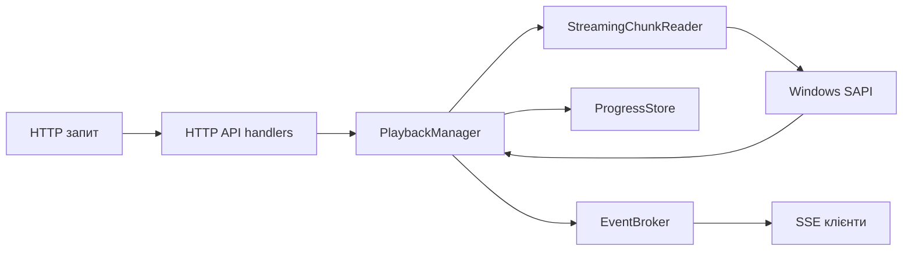

# Архітектура

## Коротко

`tts-reader` має два режими:

1. локальний CLI;
2. локальний HTTP API з SSE-подіями та браузерною панеллю.

Основний потік виконання побудований так:

```mermaid
flowchart LR
  HTTP[HTTP запит] --> API[HTTP API handlers]
  API --> PM[PlaybackManager]
  PM --> CR[StreamingChunkReader]
  CR --> TTS[Windows SAPI]
  TTS --> PM
  PM --> PS[ProgressStore]
  PM --> EB[EventBroker]
  EB --> SSE[SSE клієнти]
```

## Потік даних

## Межі пакетів

Доменна логіка розділена на окремі internal packages:

- `internal/book` відповідає за модель книги, in-memory registry, абсолютні шляхи та file identity checks.
- `internal/chunk` містить streaming reader, smart chunk boundaries, UTF-8 byte-boundary helpers і пошук стартової фрази.
- `internal/progress` відповідає за JSON progress format, прив'язку progress до книги, міжпроцесний lease й атомарну заміну progress-файла.
- `internal/tts` містить TTS interfaces, voice model і function-based engine adapter.
- `internal/events` містить generic event broker з backpressure policy.
- `internal/playback` збирає book, chunk, progress, tts та events у playback state machine.
- `internal/httpapi` містить DTO, згенеровані з `api/openapi.yaml`; handlers перетворюють ці transport types на доменні запити.

Root package лишається application layer:

- CLI parsing і режим `read`;
- локальний HTTP API;
- dashboard;
- platform entrypoints для Windows SAPI.

Це дає реальні компіляторні межі: HTTP handlers не мають доступу до приватних полів `PlaybackManager`, progress package не знає про HTTP, generic event broker не знає про playback snapshot, OpenAPI DTO не містять доменної логіки, а Windows SAPI adapter залежить лише від `internal/tts`.

Низькорівневі adversarial-тести, які перевіряють stale sessions, durable position і race invariants, живуть поруч із state machine в `internal/playback`.

### HTTP -> playback engine -> chunk reader -> Windows SAPI

- HTTP handlers приймають запити `POST /api/v1/playback`, `POST /api/v1/playback/pause`, `POST /api/v1/playback/resume`, `POST /api/v1/playback/stop` і `PUT /api/v1/playback/position`.
- Handlers викликають `PlaybackManager`.
- `PlaybackManager` керує станом відтворення, вибирає стартову позицію, запускає `StreamingChunkReader` і передає кожен chunk у TTS engine.
- `PlaybackManager` зберігає доменну помилку та `error_code`, а HTTP layer перетворює їх у публічний текст відповіді.
- На Windows TTS engine викликає PowerShell з `System.Speech`, а текст передається через `stdin`.

## Хто володіє goroutine

### HTTP server goroutine

- `runServe` запускає `server.ListenAndServe()` у окремій goroutine.
- Життєвий цикл цієї goroutine завершується через `server.Shutdown(...)`.

### Playback goroutine

- `PlaybackManager.Start` створює окрему goroutine для `play(...)`.
- Саме ця goroutine читає chunks, викликає TTS і зберігає progress.
- `Stop` скасовує session context, чекає завершення `session.done` і тільки потім завершує сесію.

### SSE goroutine

- SSE handler не створює фонову goroutine для delivery.
- Він лише підписується на `EventBroker` і блокується в request context.
- Коли клієнт закриває вкладку або сервер завершується, `r.Context()` спрацьовує, підписка закривається, канал клієнта відписується.

## Pause / Resume / Stop

### Pause

- `Pause` змінює стан на `paused`.
- Playback goroutine перевіряє стан через `waitUntilPlayable(...)` і чекає на `sync.Cond`.
- Відтворення не створює нову сесію, а лише тимчасово зупиняється.

### Resume

- `Resume` повертає стан у `playing`.
- `cond.Broadcast()` будить playback goroutine.
- Далі читання chunk продовжується з поточної позиції.

### Stop

- `Stop` переводить сесію у `stopping`, скасовує session context і викликає `TTSEngine.Stop(...)` лише один раз.
- `Stop` не очищає `active` і не створює terminal snapshot: цим одноосібно володіє session finalizer.
- Finalizer зберігає durable position, атомарно очищає `active`, встановлює `lastErr`, формує snapshot і публікує `playback.stopped`.
- Якщо `Stop` не дочекався завершення до timeout, він повертає transient `ErrStopping` і не змінює сесію повторно; після фактичного завершення goroutine finalizer переводить стан у `stopped` без timeout-помилки.

## Як закриваються SSE-клієнти

- SSE клієнт підписується через `PlaybackManager.SubscribeEvents()`.
- Реєстрація клієнта та постановка початкового `playback.snapshot` у його чергу виконуються атомарно; live event не може випередити initial snapshot.
- Підписка повертає канал подій і `unsubscribe`.
- На виході з handler підписка завжди закривається через `defer unsubscribe()`.
- Для коректного завершення сервера `BaseContext` від `http.Server` скасовується через `cancelServe()`, тому відкриті SSE-запити виходять без зависання shutdown.
- Кожна подія має monotonic `seq`, який також записується як SSE `id`.
- Новий SSE клієнт одразу отримує `playback.snapshot` з актуальним станом.
- Зміна playback state, створення snapshot і передача події broker виконуються під одним `PlaybackManager.mu`, тому подія зі старим active state не може отримати sequence після `playback.stopping`.
- `chunk.started` і `progress.updated` є best-effort подіями, тому їх можна пропустити при backpressure.
- Lifecycle-події не відкидаються мовчки: якщо клієнт не встигає читати і його канал переповнений, broker закриває цей клієнт, після чого браузерний `EventSource` перепідключається та отримує новий snapshot.
- SSE handler періодично надсилає heartbeat comments, щоб довге з'єднання не виглядало мертвим для клієнта або проміжного proxy.

## Де і коли зберігається прогрес

Прогрес зберігається в таких точках:

1. після кожного успішно озвученого chunk;
2. після `Stop`;
3. після помилки читання;
4. після помилки TTS;
5. після panic у CLI;
6. після завершення книги прогрес скидається в `0`.

Реалізація зберігання локальна:

- `ProgressStore.Save(...)` пише JSON у user cache (`%LOCALAPPDATA%\tts-reader\progress` на Windows) за SHA-256 канонічного book path;
- атомарна заміна файла використовується, щоб не отримати напівзаписаний progress;
- CLI або playback session утримує міжпроцесний lease до фінального запису, тому для однієї книги завжди є лише один writer;
- `Load(...)` перевіряє version, UTF-8 межі, розмір, modification time і повний streaming SHA-256 fingerprint книги, щоб progress не можна було випадково застосувати до іншого тексту.

## Чому позиція вимірюється в байтах

Позиція зберігається в байтах, а не в rune-індексах, бо:

- `os.File.Seek(...)` працює з байтовими зміщеннями;
- UTF-8 має змінну довжину rune;
- прогрес потрібно відновлювати точно навіть після зміни книги;
- `isFileUTF8Boundary(...)` може перевірити, чи байтова позиція не потрапляє всередину rune;
- один і той самий файл можна читати частинами без повного завантаження в пам’ять.

Це дозволяє:

- уникати повторного озвучення частини символу;
- коректно працювати з кирилицею, emoji та іншими UTF-8 даними;
- відновлювати читання з тієї ж байтової межі після перезапуску.
